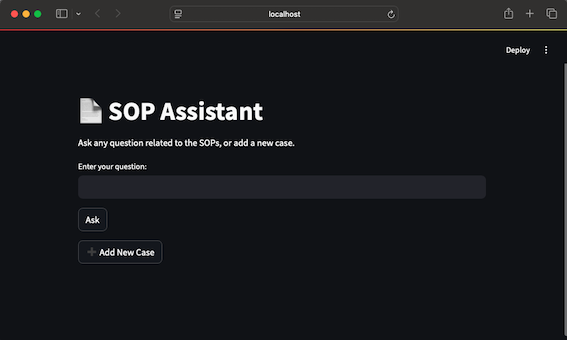
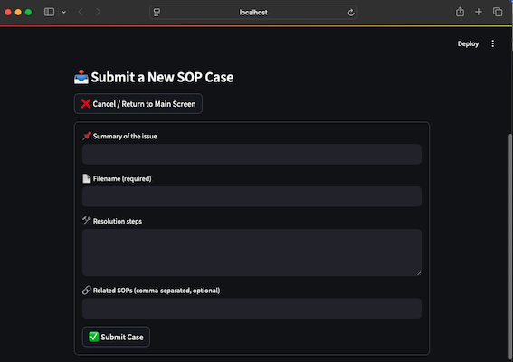

# SOPs Assistant

**SOP Assistant** is an intelligent tool intended to help Site Reliability Engineers resolve alerts by retrieving solutions from a Retrieval-Augmented Generation (RAG) database. It allows querying existing SOPs or adding new documentation and operational knowledge, making that information instantly searchable and reusable for future incidents.  
A planned feature will also enable automatic creation of Jira tasks to review whether newly submitted information should be promoted to official SOPs.  
**Note**: This is an initial investigation project, and future improvements and features are planned to enhance its capabilities.

## Features

- Loads operational knowledge and SOP documents from a local directory 
- Retrieves relevant information using semantic search over document embeddings 
- Responds to natural language questions using a local LLM (Mistral via Ollama)
- Supports adding new alert cases and operational solutions 
- Maintains a growing knowledge base that can be queried and reused over time
- **Experimental:** Hybrid and External modes allow combining internal SOPs with web search or querying external sources only (CLI only, under development)
---

## Tech Stack

- **LangChain** – For chaining the LLM and document retriever.
- **Ollama + Mistral** – Local LLM backend.
- **Hugging Face Embeddings** – For generating semantic embeddings.
- **Chroma** – Fast and lightweight local vector database.
- **Python 3.8+**
- **Streamlit** - UI


---

## Installation

1, Clone the repository
```bash
git clone https://github.com/your-username/sop-assistant.git
cd sop-assistant
```
2. Create and activate a virtual environment
```bash
python -m venv venv
source venv/bin/activate 
```
3. Install the required packages
```bash
pip install -r requirements.txt
```

4. Ensure Ollama and Mistral are installed and running
```bash
ollama run mistral
```

5. Add SOP documents to the ./sops directory (.asceedic, .md, .txt)

## Usage
### CLI
- To start the assistant from command line (CLI):
```bash
python main.py
```

- You’ll see:
```bash
Loading SOP documents...
100%|██████████████████████████████████████████████████████████████████████| 60/60 [00:00<00:00, 11886.37it/s]
🧠 Creating vector database...
✅ Loaded 2 AWS documentation URLs.
🤖 SOP Assistant ready. Type your question below.
   Type 'add case' to add a new issue/solution.
   Type 'mode' to switch between RAG / Hybrid / External.
   Type 'help' for commands.
   Type 'exit' to quit.

📝 You: 
```

You can now:
- Ask any SOP-related question.
- Type `add case` to submit a new scenario.
- Type `mode` to switch between RAG / Hybrid / External.
- Type `help` for commands.
- Type `exit` to quit.

### Streamlit UI
- To launch the assistant in UI mode, run::

```shell
streamlit run app.py
```
This will start a web-based interface where you can interact with the SOP Assistant — including adding new cases to extend the knowledge base.







## Example Queries

```bash
📝 You: What is the escalation path for a production outage?
📝 You: How do I handle a <Alert Name> alert?
📝 You: redis full
📝 You: add case
```

## TODOs
 - Enable automatic embedding refresh on new files
 - Add a feature to automatically create Jira tasks to review whether newly submitted information should be promoted to official SOPs 
 - Improve AI responses by using predefined templates for document retrieval
 - Improve UI

## Ideas for Future Expansion
 - Add web lookup functionality  
   To assist with troubleshooting steps not covered by internal SOPs, and to help verify whether documentation is current and aligned with best practices.
 - Extend the local tool into a web service  
   Converting the tool into a web-based service would eliminate the need for local setup, making it easily accessible for different SRE teams in the Company.
 - Introduce MCP for modularity and extensibility  
   Implementing the MCP would allow the assistant to connect with external tools in a standardized way. This would make it easier to add new capabilities and integrate with other AI agents or systems in the future.

